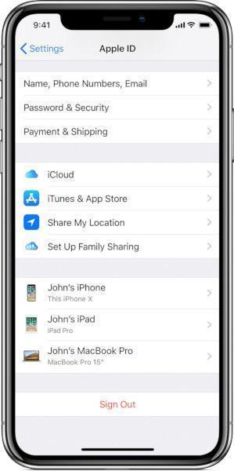

# Review iCloud Accounts

Low-sophistication attackers might be able to monitor the activity of an iOS device by adding an additional iCloud account. The account would then normally be configured to automatically backup to iCloud all the data available on the phone (such as pictures, messages, contacts, etc.). The addition of an iCloud account normally requires physical access to the device. Once the iCloud account is enabled on the device, attackers are then simply able to inspect the data directly from iCloud or using an external service that synchronizes with the iCloud backups.

Checking if an iOS device has unwanted iCloud accounts can be trivially done by opening the *Settings* and looking at the very top of the menu.

## Attackers Using Stolen Credentials

Obviously, if attackers have managed to steal the credentials to the legitimate iCloud account of the device owner, it is not necessary for them to add an additional account to the phone. This is also [a common tactic](https://www.vice.com/en_us/article/4xpgnj/paranoid-spouses-can-spy-on-partners-ios-10-devices-with-icloud-backups). While in this case no additional iCloud would be visible in the settings, an unrecognized device might appear to be enabled on the existing account. [Here are instructions on how to review connected devices](https://support.apple.com/en-us/HT205064).

*Image from Apple*
