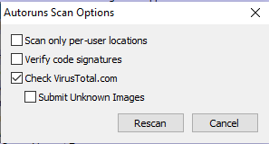
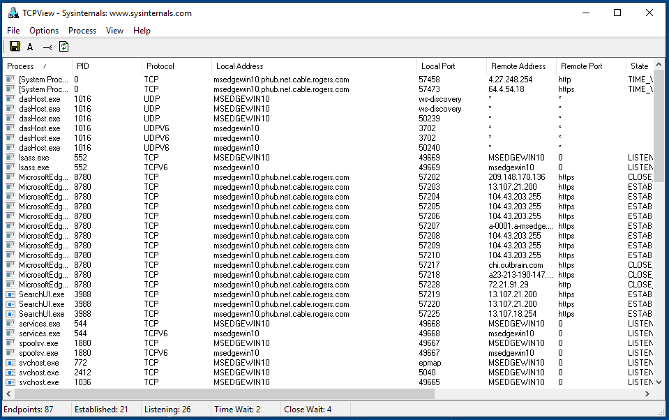
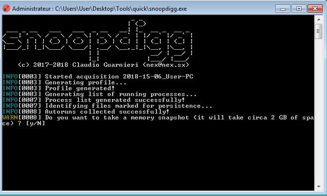
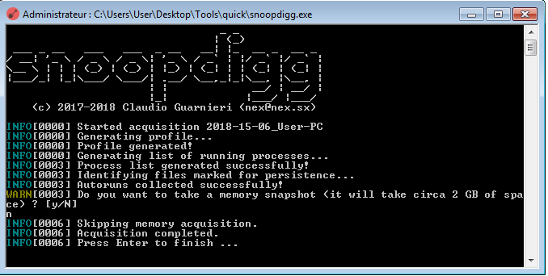

# Windows

## Checking Programs on Startup

Malware need to find a way to run on start-up when a computer is rebooted, it is thus one of the first thing to check when looking for malicious programs. Windows systems have different ways to have programs running on startup, and malwware often use tricks to appears legitimate and/or avoiding standard autoruns methods.

The [Sysinternals Autoruns](https://technet.microsoft.com/en-ca/sysinternals/bb963902.aspx) tool allows to list exhaustively the programs running on start-up (you should run this program as Administrator if possible) :

Autoruns embedds a feature to check for binary files on [VirusTotal](https://www.virustotal.com/gui/home/upload), it is a very good way to do a first check on suspicious files (check the "About Virus Total" part after for more information). To enable check on VirusTotal, go in Options > Scan Options and enable "Check VirusTotal.com" (be careful of not enabling "Submit Unknown Files") :

Then Autoruns will take a bit of time to check for all the files on startup and add results under the form _X/X_ where the first X is the number of antiviruses detecting this file as malicious and the second X is the total number of antiviruses checked.

Use this analysis to look more closely to :
* Any file detected as Malicious by at least one antivirus
* Any file unknown by VirusTotal

Then look for suspicious entries manually in tabs `Logon`, `Scheduled Tasks`, `Services`.

For each of these entries, you should look for :
* **The name of the entry :** a random string would be suspicious, or any common name with typo (crhome)
* **The description :** most legitimate programs have a description
* **The path :** any program installed in C:\Users is suspicious (often in C:\Users\USERNAME\AppData), C:\Temp is clearly abnormal, most of the programs should be in C:\Program Files or C:\Program Files (x86)

Common tricks :
* Many malware will use the Windows program `rundll32.exe` to load the actual malicious file (often a dll file but that can be named otherwise). As rundll32 will be checked on VirusTotal it will avoid the detection

Example of suspicious entries :
* The KeyBoy malware creates a Registry Key in `HKEY_CURRENT_USER\SOFTWARE\Microsoft\Windows NT\CurrentVersion\Winlogon\shell` with the value `explorer.exe,C:\Windows\system32\rundll32.exe "%LOCALAPPDATA%\cfs.dal" cfsUpdate`

### About VirusTotal

[VirusTotal](https://www.virustotal.com/gui/home/upload) (often called VT) is originally a Spanish company acquired by Google in 2012. Its business model is to provide checking of files by many anviruses for free to everyone, and sell access to this data to security companies. So keep in mind that files uploaded to VirusTotal are _not kept confidential_.

There are two ways to check for a file in VirusTotal :
* Check if the fingerprint is known by VirusTotal : this is what is done by default by Sysinternals tools, it means that the file itself is not sent to VirusTotal, but it only check if the file is already known by VT. All Windows system files should be known, an unknown file on startup is definitely suspicious
* Upload the file to VirusTotal : in that case the file is sent ot VirusTotal which analyze it using multiple antiviruses. Keep in mind that VirusTotal will share this file with its customers, so do not upload any sensitive information.

Regarding results :
* A file having more than 5 antiviruses detecting it as malicious definitely indicate a malware. You can check for the name of the malware given by antiviruses or comment to have an idea of what kind of malware it can be.
* A file with less then 5 antiviruses can be either a malicious file detected y few antiviruses, or a legitimate file with false positive detection
* A file known by VT without any

## Checking Processes

[Process Explorer](https://technet.microsoft.com/en-us/sysinternals/processexplorer.aspx) from sysinternals list all the processes running on the system hierarchically :

Process Explorer should directly check the file hashes on VirusTotal, it is a good first step to identify suspicious processes. Then you should look for :
* Every program running from user directory (C:\Documents and Settings\USERNAME or C:\Users\USERNAME) is suspicious, especially the programs running from AppData
* Check for program with a name very close to a legitimate Windows process but with a small difference (lass.exe instead of lsass.exe…)
* Check for programs with a legitimate windows name (svchost.exe) outside of standard Windows directories

## Checking Network Communications

[TCPView](https://technet.microsoft.com/en-us/sysinternals/tcpview.aspx) allows to look for suspicious network communications.

Check for any process with a suspicious connection, like an unknown process communicating on an unusual port.

## Dumping Interesting Data for Further Analysis

[Snoopdigg](https://github.com/botherder/snoopdigg) is a tool that allows to dump startup information and actual processes, along with memory for further analysis. It is really helpful for instance if you do not have time to check for everything on the computer and want to double check if there is anything suspicious later on.

You should run this program from a USB key with enough storage space, double click on the binary file and follow the instructions.

Unless you have a good reason to do so, it is recommended not to take a memory snapshot as it is contains a lot of private information (it may contains passwords for instance).

Once finished, it will create a folder named acquisitions, with a subfolder based on computer name and date, which contains :
* A `profile.json` file containing basic information on the computer system.
* A `processlist.json` file containing a list of running processes.
* An `autoruns.json` file containing a list of all items with persistence on the system.
* An `autoruns/` folder containing copies of the files and executables marked for persistence in the previous JSON file.
* If requested, a `memory/` folder will contain a physical memory dump as well as some metadata.

